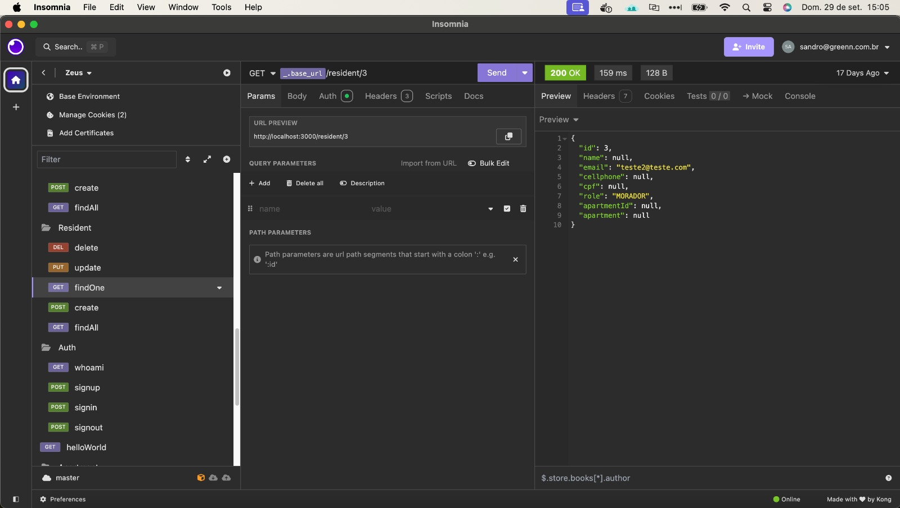
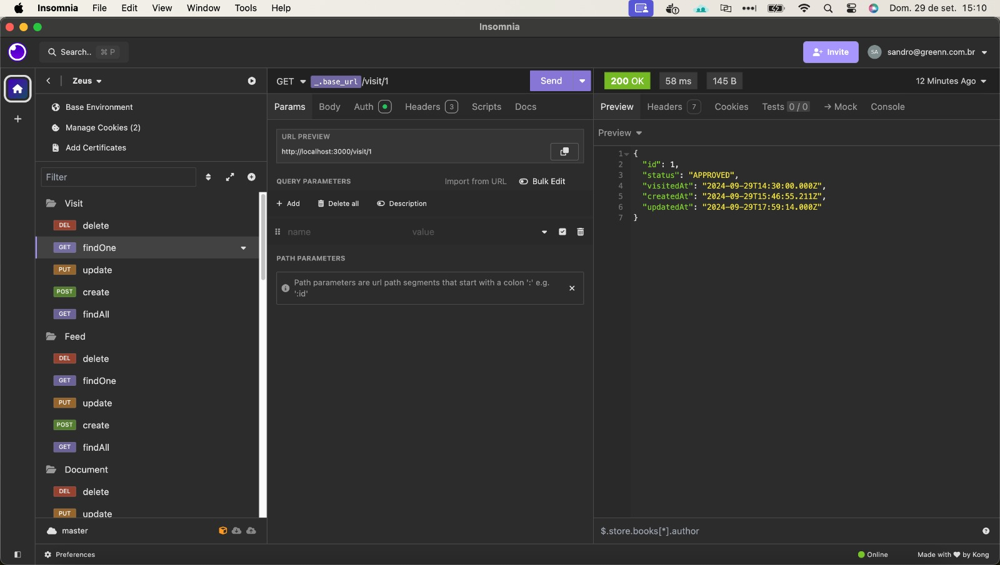

# APIs e Web Services

O projeto "Zeus - Gestão Condominial" é um aplicativo voltado para melhorar a comunicação entre a administração do condomínio e os moradores. Ele busca automatizar avisos importantes, como uso de máscaras, boletos em atraso, notificações de visitas e reservas de espaços, evitando atrasos ou falta de conhecimento. Com isso, o aplicativo centraliza informações essenciais, permitindo a gestão de moradores, funcionários e visitantes, além de facilitar a comunicação entre as partes, otimizando o funcionamento e o controle dentro do condomínio.

## Objetivos da API

### Objetivo Geral
Facilitar a comunicação entre o síndico e os residentes do condomínio, proporcionando um canal eficiente e automatizado de troca de informações.

### Objetivos Específicos

1. Centralizar Informações de Gestão (Principal):

    • Disponibilizar e gerenciar atas de reuniões, estatutos e balancetes financeiros para  fácil acesso dos moradores e administração.

2. Facilitar a Comunicação Entre Administração e Moradores (Principal):

    • Criar endpoints que permitam o envio e recebimento de comunicados e notificações entre o síndico e os residentes, de forma automatizada e sem burocracia.

3. Controle de Cadastro (Principal):

    • Gerenciar o cadastro de moradores, funcionários e visitantes, possibilitando atualizações em tempo real e integração com os sistemas de controle de acesso do condomínio.

4. Gerenciamento de Entradas e Saídas (Secundário):

    • Implementar funcionalidades para registrar a entrada e saída de visitantes, integrando com os sistemas de portaria para garantir maior segurança e controle no condomínio.

Esses objetivos buscam centralizar as operações essenciais para o bom funcionamento do condomínio, otimizando a comunicação e o gerenciamento de pessoas e informações.

## Arquitetura

As APIs foram desenvolvidas no padrão RESTful separado pelos seguintes módulos:
- Auth
- User
- Apartment
- Resident
- Visitor
- Employee
- Document
- Feed
- Visit

## Modelagem da Aplicação

Nossa estrutura de dados se constitui das entidades:
- user
- visitor
- visit
- feed
- document
- apartment

Os diagramas de modelagem segue nas imagens abaixo:


## Fluxo de Dados

[Diagrama ou descrição do fluxo de dados na aplicação.]

## Requisitos Funcionais

1. O sistema deve permitir o gerenciamento de dados do morador.

2. O sistema deve permitir o gerenciamento de dados de apartamento.

3. O sistema deve permitir o gerenciamento de dados de usuário.

4. O sistema deve permitir o gerenciamento de dados de funcionários.

5. O sistema deve permitir o gerenciamento de dados de quadro de avisos.

6. O sistema deve permitir a autenticação de usuários.

## Requisitos Não Funcionais

1. Disponibilidade: O sistema deve ficar online 24H por dia, 7 dias na semana.

2. Desempenho: O sistema deve permitir que complete uma requisição de no máximo 3 segundos.

3. Segurança: O produto deve restringir o acesso por meio de senhas individuais para o usuário.

## Tecnologias Utilizadas

### Back-end

O backend será desenvolvidos utilizando Nest.js, um ambiente multiplataforma para JavaScript e MySQL como banco de dados relacional e Minio para gerenciamento de arquivos.

## API Endpoints

Segue a lista dos endpoints do sistema:

- Fazer login

`{base_url}/auth/signup`

POST 

```
{
	"email": "teste10@teste.com",
	"password": "Teste123#",
	"role": "ADMIN"
}
```


- Fazer login

`{base_url}/auth/signin`

POST 

```
{
	"email": "teste@teste.com",
	"password": "Teste123#"
}
```

- Fazer Logout

`{base_url}/auth/signout`

POST

- Verificar dados do usuário logado

`{base_url}/auth/whoami`

GET

- Buscar usuário pelo id

`{base_url}/user/{id}`

GET

- Buscar usuário pelo e-mail

`{base_url}/user?email={email}`

GET

- Atualização de usuário

`{base_url}/user/{id}`

PUT 

```
{
    "name": "Sandro Souza",
    "email": "teste@teste.com",
    "cellphone": "31998136678",
    "cpf": "01619398133",
    "password": "Teste123#"
}
```

- Deletar usuário

`{base_url}/user/{id}`

DELETE

- Criar apartamento

`{base_url}/apartment`

POST 

```
{
	"number": 104,
	"block": "A"
}
```

- Buscar apartamento pelo id

`{base_url}/apartment/{id}`

GET 

- Buscar todos apartamentos

`{base_url}/apartment`

GET 

- Atualizar apartamento

`{base_url}/apartment/{id}`

PUT 

```
{
	"number": 101,
	"block": "B"
}
```

- Deletar apartamento

`{base_url}/apartment/{id}`

DELETE

- Criar morador

`{base_url}/resident/`

POST 

```
{
	"email": "teste9@resident.com",
	"password": "Teste123#",
	"name": "Prof. Kleber",
	"cellphone": "65435742573",
	"cpf": "7457645643563",
	"role": "MORADOR",
	"apartmentId": 4
}
```

- Buscar morador por id

`{base_url}/resident/{id}`

GET 

- Buscar todos moradores

`{base_url}/resident`

GET 

- Atualizar morador

`{base_url}/resident/{id}`

PUT

```
{
	"name": "Eduardo Monteiro",
	"email": "teste4@resident.com",
	"cellphone": "93984756478",
	"cpf": "48473625475",
	"role": "MORADOR",
	"apartmentId": 3
}
```

- Deletar morador

`{base_url}/resident/{id}`

DELETE

- Criar visitante

`{base_url}/visitor`

POST

```
{
	"name": "Prof. Kleber",
	"cellphone": "7664839048",
	"cpf": "984783684"
}
```

- Buscar visitante por id

`{base_url}/visitor/{id}`

GET

- Buscar todos visitantes

`{base_url}/visitor`

GET

- Atualizar visitante

`{base_url}/visitor/{id}`

PUT

```
{
	"name": "Teste Kleber",
	"cellphone": "7664839048",
	"cpf": "984783684"
}
```

- Deletar visitante

`{base_url}/visitor/{id}`

DELETE

- Criar funcionário

`{base_url}/employee`

POST

```
{
	"email": "teste@employee.com",
	"password": "Teste123#",
	"name": "Tarcisio de Amaral",
	"cellphone": "43545342434",
	"cpf": "0384289374573",
	"role": "PORTEIRO"
}
```

- Buscar funcionário por id

`{base_url}/employee/{id}`

GET

- Buscar todos funcionários

`{base_url}/employee`

GET

- Atualizar funcionário

`{base_url}/employee/{id}`

PUT

```
{
	"email": "teste@employee.com",
	"password": "Teste123#",
	"name": "Tarcisio de Amaral Teste",
	"cellphone": "43545342434",
	"cpf": "0384289374573",
	"role": "PORTEIRO"
}
```

- Deletar funcionário

`{base_url}/employee/{id}`

DELETE

- Criar documento

`{base_url}/document`

POST

```
formData - Multipart
{
	"name": "Arquivo teste",
	"description": "teste teste teste",
	"file": File.pdf (File)
}
```

- Buscar documento por id

`{base_url}/document/{id}`

GET

- Buscar todos documentos

`{base_url}/document`

GET

- Atualizar documentos

`{base_url}/document/{id}`

PUT

```
formData - Multipart
{
	"name": "Arquivo teste teste",
	"description": "teste teste teste edit",
	"file": File2.pdf (File)
}
```

- Deletar documentos

`{base_url}/document`

DELETE

- Criar feed de notícia

`{base_url}/feed`

POST

```
formData - Multipart
{
	"title": "Detetização",
	"description": "Prepara que vem ai",
	"file": Img.png (File)
}
```

- Buscar feed de notícia por id

`{base_url}/feed/{id}`

GET

- Buscar todos feed de notícias

`{base_url}/feed`

GET

- Atualizar feed de notícias

`{base_url}/feed/{id}`

PUT

```
formData - Multipart
{
	"title": "Detetização edit",
	"description": "Prepara que vem ai",
	"file": Img2.png (File)
}
```

- Deletar feed de notícias

`{base_url}/feed/{id}`

DELETE

- Criar visita

`{base_url}/visit`

POST

```
{
	"visitorId": 1,
	"userId": 2,
	"status": "PENDING",
	"visitedAt": "2024-09-29 14:30"
}
```

- Buscar visita por id

`{base_url}/visit/{id}`

GET

- Buscar todas visitas

`{base_url}/visit`

GET

- Atualizar visita

`{base_url}/visit/{id}`

PUT

```
{
	"visitorId": 1,
	"userId": 2,
	"status": "APPROVED",
	"visitedAt": "2024-09-29 14:30"
}
```

- Deletar visita

`{base_url}/visit/{id}`

DELETE


## Considerações de Segurança

Modelo de token utilizado na API é o JSON Web Token (JWT), ele é um padrão de segurança amplamente utilizado para autenticação em APIs. Ele permite que informações sejam transmitidas de maneira segura entre partes por meio de um token assinado digitalmente. O token é composto por três partes: header (cabeçalho), payload (dados) e signature (assinatura). A assinatura garante a integridade dos dados e autentica a identidade do usuário. JWT é usado principalmente para controlar o acesso a recursos protegidos, validando a autenticação e autorização de forma rápida e eficiente, sem a necessidade de armazenar o estado do usuário no servidor.

## Implantação

Estas instruções ajudam a configurar e implantar a aplicação em um ambiente de produção de forma segura e escalável.

1. Requisitos de Hardware e Software

Hardware:
- Recomenda-se um servidor com, no mínimo, 2 vCPUs e 4 GB de RAM para a aplicação e banco de dados de porte médio. Ajuste conforme a demanda.

Software:
- Node.js: Versão LTS (16.x ou superior)
- Docker e Docker Compose: Para empacotar e orquestrar os serviços (Nest.js, MySQL, MinIO)
- MySQL: Usado como banco de dados relacional; pode ser executado em contêiner ou como serviço separado na infraestrutura de produção.
- MinIO: Serviço de armazenamento de arquivos; recomenda-se configurar para SSL em produção.
- Nginx: Como proxy reverso para gerenciar melhor o tráfego e garantir segurança.

2. Plataforma de Hospedagem
Selecione uma plataforma que ofereça suporte para contêineres e escalabilidade, como:

- Amazon Web Services (AWS): Usando ECS (Elastic Container Service) ou EC2 para instâncias de contêiner ou servidor.

3. Configuração do Ambiente de Produção

Instalação de Dependências:
- Configurar o servidor com o Docker e Docker Compose.
- Instalar o Nginx para servir o backend através de um proxy reverso.

Configuração das Variáveis de Ambiente:
- Criar um arquivo .env com as variáveis de produção, incluindo:
- Banco de dados (MySQL): Host, usuário, senha e nome do banco de dados.
- MinIO: Credenciais de acesso (chave de acesso, chave secreta, endpoint com SSL habilitado).
- NestJS: Configurações como porta de execução, chave de assinatura JWT e URL base para o MinIO.

4. Implantação da Aplicação

Subir os Contêineres com Docker Compose:
- No servidor, navegue até a pasta onde estão os arquivos do projeto e o docker-compose.yml.
- Execute docker-compose up -d --build para criar e iniciar os contêineres em segundo plano.

Configurar Nginx para o Proxy Reverso:
- Configure o Nginx para redirecionar o tráfego para os contêineres de frontend e backend:
- Certifique-se de configurar redirecionamento para https se SSL estiver habilitado, incluindo certificados no Nginx.

Configuração de Segurança:
- Configure um firewall para permitir apenas portas necessárias (como 80 e 443 para HTTP/HTTPS e a porta do MySQL, se externa).
- Configure SSL para o domínio da aplicação.

5. Testes e Verificação de Funcionamento

- Testes de API: Usar ferramentas como Postman para testar endpoints críticos do NestJS.
- Validação de Uploads no MinIO: Verifique se o MinIO está armazenando e servindo arquivos corretamente.
- Monitoramento e Logs: Verifique os logs dos contêineres com docker-compose logs -f [service_name] para detectar erros.

## Testes

Os únicos testes permitidos no sistema serão os manuais e de regressão através dos endpoints já mapeado presentes na Collection dentro do projeto. Para isso podem ser usado ferramentas como Postman, Insomnia, BrunoAPI, entre outros.

Collection: <a href="../sistema/zeus-back/Collection_APIs.json"> Collection_APIs.json</a>

Casos de Teste:
- Criar conta


- Fazer login


- Fazer Logout


- Verificar dados do usuário logado


- Buscar usuário pelo id


- Buscar usuário pelo e-mail


- Atualização de usuário


- Deletar usuário


- Criar apartamento


- Buscar apartamento pelo id


- Buscar todos apartamentos


- Atualizar apartamento


- Deletar apartamento


- Criar morador


- Buscar morador por id


- Buscar todos moradores


- Atualizar morador


- Deletar morador


- Criar visitante


- Buscar visitante por id


- Buscar todos visitantes


- Atualizar visitante


- Deletar visitante


- Criar funcionário


- Buscar funcionário por id


- Buscar todos funcionários


- Atualizar funcionário


- Deletar funcionário


- Criar documento


- Buscar documento por id


- Buscar todos documentos


- Atualizar documentos


- Deletar documentos


- Criar feed de notícia


- Buscar feed de notícia por id


- Buscar todos feed de notícias


- Atualizar feed de notícias


- Deletar feed de notícias


- Criar visita


- Buscar visita por id


- Buscar todas visitas


- Atualizar visita


- Deletar visita


# Referências

Documentação levantada no projeto nosso em semestres anteriores conforme o link abaixo:

<a href="https://docs.google.com/document/d/1DjpDkHZf0630EwuFNUmLxaGB0QGOzr13_3GeTDPsa5U/edit?usp=sharing"> Documentação do Projeto</a>
