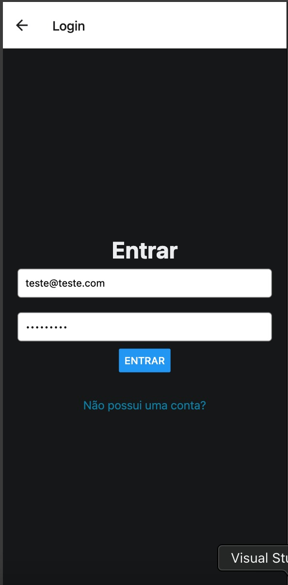
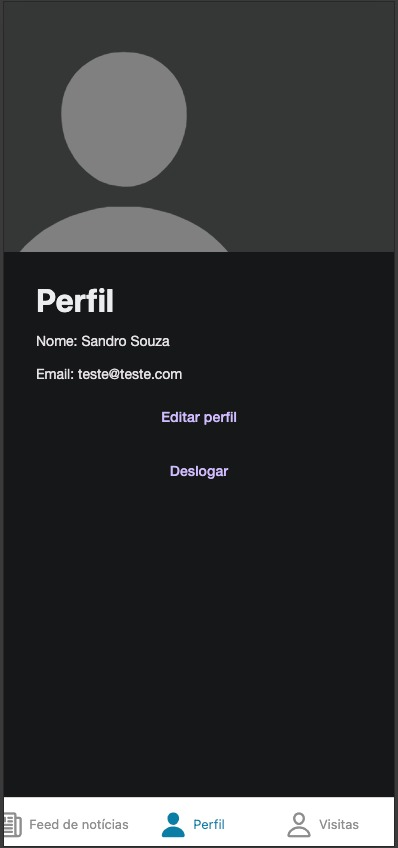
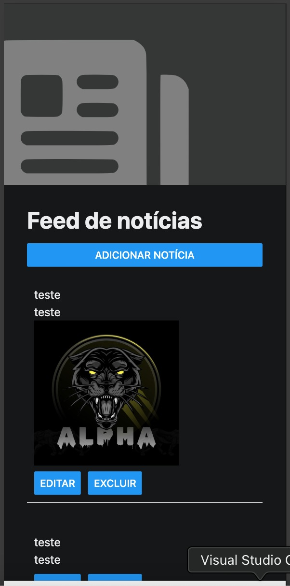

# Front-end Móvel

O projeto mobile do sistema "Zeus - Gestão Condominial" tem como objetivo principal facilitar a comunicação entre o síndico e os moradores, centralizando informações de gestão e automatizando a troca de notificações. Ele é focado na visão do morador, oferecendo funcionalidades como um quadro de comunicação e notícias do condomínio, controle de visitantas e edição de perfil.

## Tecnologias Utilizadas

- React Native
- Expo
- React Native Paper

## Arquitetura

Componentes de acesso, noticias, perfil e visitas.

### Design Visual

### Interações do Usuário

Usuário pode acessar o aplicativo, fazer cadastro ou login, visualizar, criar, editar noticias e visitas.

## Requisitos Funcionais

| ID     | Descrição do Requisito                                       | Prioridade |
| ------ | ------------------------------------------------------------ | ---------- |
| RF-001 | O SISTEMA DEVE PERMITIR A EDIÇÃO DE PERFIL DO USUÁRIO LOGADO | ALTA       |
| RF-002 | O SISTEMA DEVE PERMITIR A APROVAÇÃO DE VISITAS               | ALTA       |
| RF-003 | O SISTEMA DEVE PERMITIR A CRIAÇÃO DE UMA CONTA               | ALTA       |
| RF-004 | O SISTEMA DEVE PERMITIR A AUTENTICAÇÃO DE USUÁRIOS           | ALTA       |
| RF-006 | O SISTEMA DEVE PERMITIR A VISUALIZAÇÃO DO QUADRO DE AVISOS   | MÉDIA      |

## Requisitos Não Funcionais

| ID      | Descrição do Requisito                                                                                          | Prioridade |
| ------- | --------------------------------------------------------------------------------------------------------------- | ---------- |
| RNF-001 | Usabilidade: O sistema deve permitir que complete uma tarefa de aprovação de visita em no máximo 1 minuto.      | BAIXA      |
| RNF-002 | Disponibilidade: O sistema deve ficar online 24H por dia, 7 dias na semana                                      | BAIXA      |
| RNF-003 | Segurança: O produto deve restringir o acesso por meio de senhas individuais para o usuário.                    | BAIXA      |
| RNF-004 | Usabilidade: Para utilizar o sistema, é necessário ter noções básicas de tecnologia e operação de computadores. | BAIXA      |

## Considerações de Segurança

Utiliza JWT assim como no front na versão web.

### Casos de Teste para usuário

**Editar perfil**
Dado: Morador já cadastrado e logado na aplicação.
Quando: Usuário clica na aba de perfil, clica em editar perfil, edita informações e clica em salvar.
Então: As informações atualizadas são salvas e exibidas corretamente.

### Casos de Teste para Visitas

**Aprovar Visita**
Dado: Visita pendente listada.
Quando: Usuário clica em aprovar.
Então: Visita é aprovada.

**Rejeitar Visita**
Dado: Visita pendente listada.
Quando: Usuário clica em rejeitar.
Então: Visita é rejeitada.

### Casos de Teste para o feed de notícias

**Criar Post**
Dado: O usuário abre a página de feed de notícias.
Quando: Preenche o título, descrição, e opcionalmente uma imagem, e clica em no botão para criar o novo post.
Então: Um novo post é adicionado ao feed de notícias com as informações preenchidas.

**Editar Post**
Dado: Post existente no feed de notícias.
Quando: Usuário clica em editar o post, altera qualquer campo (título, descrição ou imagem) e clica em "Salvar".
Então: As informações atualizadas são exibidas no feed de notícias.

**Excluir Post**
Dado: Post listado no feed de notícias.
Quando: Usuário clica em "Excluir" e confirma.
Então: O post é removido do feed de notícias.

# Referências

- [Expo](docs.expo.dev/)
- [React Native Paper](https://reactnativepaper.com/)
