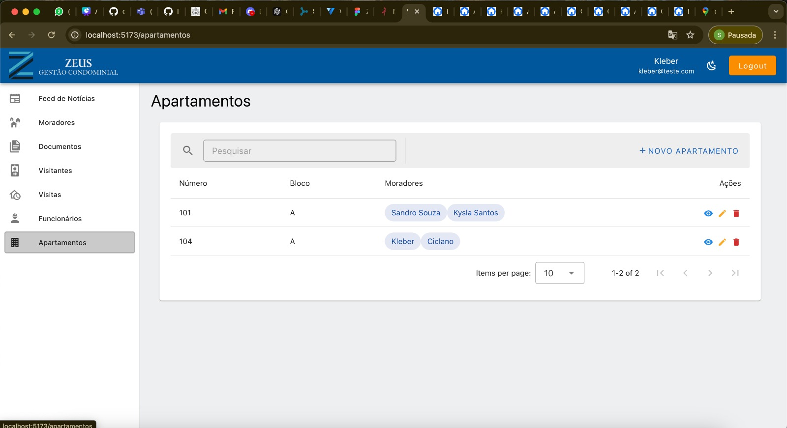
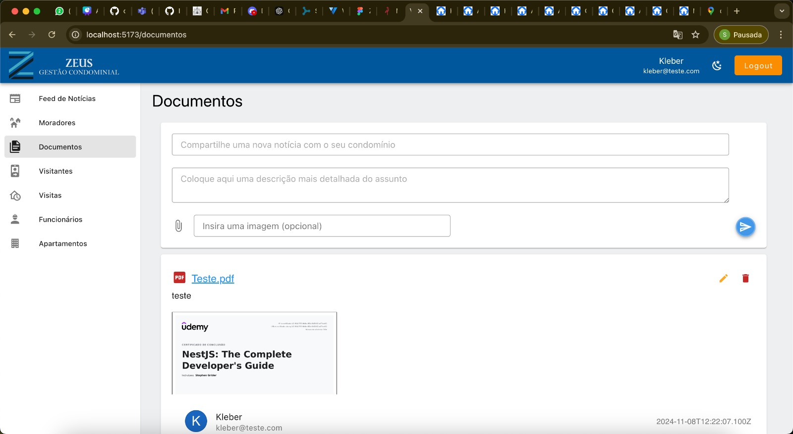
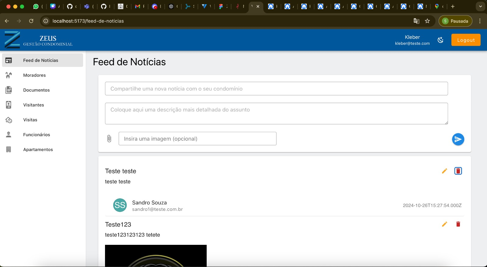
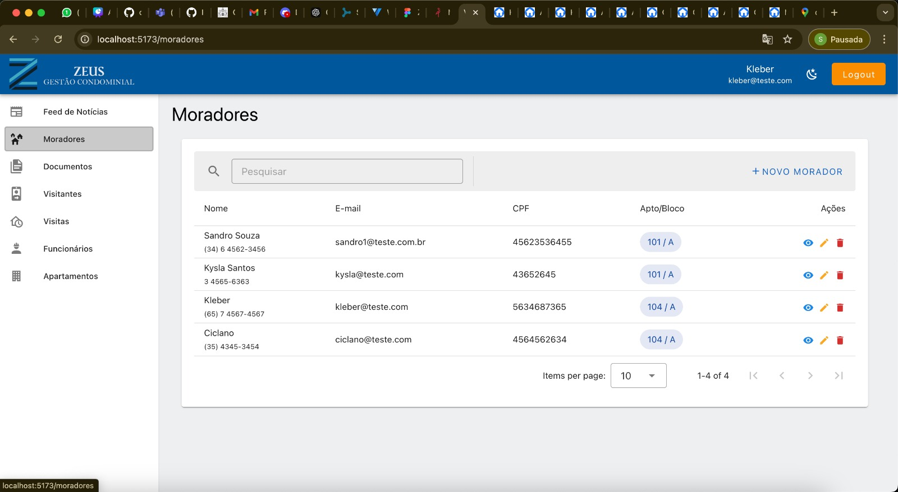
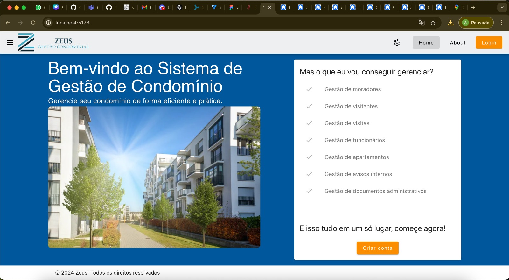

# Front-end Web

O projeto front-end do sistema "Zeus - Gestão Condominial" tem como objetivo principal facilitar a comunicação entre o síndico e os moradores, centralizando informações de gestão e automatizando a troca de notificações. Ele oferece funcionalidades como um quadro de comunicação e notícias do condomínio, além de um controle eficiente de cadastro de moradores, funcionários e visitantes. Também permite o registro de visitantes para controle de acesso, proporcionando maior segurança e facilidade na administração do condomínio.

## Tecnologias Utilizadas

- Typescript
- Vue.js 3
- Docker
- Pinia
- Axios
- Vuetify
- Vue Router

## Arquitetura

O Vue possui uma estrutura base com as view, router, components, com renderização de componentes no modelo o SPA (Single Page Aplication) com SCR (Side Client Rendering).

As view principais foram divididas entre a Site e Sistema, sendo o Sistema com diversas views relacionadas aos nossos serviços e cada serviço com seus respectivos componentes auxiliares para consumo das APIs realizando o CRUD de cada um, como Modais, Tabelas, Formulários e etc.

Também conta com uma pasta de interface referente a cada serviço do sistema para melhor controle de tipagem.

E por fim, utiliza o Pinia para fazer controle central de estado das variaveis reutilizadas por diversos componentes, separado por modulos referentes aos serviços disponíveis no sistema.

Serviços:

- Auth
- User
- Apartment
- Resident
- Visitor
- Employee
- Document
- Feed
- Visit

## Modelagem da Aplicação

Nossa estrutura de dados se constitui das entidades:

- user
- visitor
- visit
- feed
- document
- apartment

Os diagramas de modelagem segue nas imagens abaixo:

## Projeto da Interface Web

A interface web do sistema de gestão de condomínios é projetada com foco na usabilidade, responsividade e experiência do usuário, permitindo fácil navegação em diferentes dispositivos.

### Design Visual e Layout

• Estilo visual: A interface adota um design moderno e minimalista, com uma paleta de cores sóbria e neutra (tons de azul, cinza e branco), focada em transmitir simplicidade e profissionalismo. Ícones são utilizados para auxiliar na identificação rápida das funções.

• Tipografia: Fonte sans-serif clara, com tamanhos ajustados para boa legibilidade em dispositivos móveis e desktop.

• Responsividade: Todas as páginas são desenvolvidas com um design mobile-first, utilizando técnicas de CSS Flexbox e Grid para garantir que o layout se ajuste dinamicamente a diferentes resoluções de tela, desde smartphones até monitores de desktop.

### Layout das Páginas

- Página de Login:

• Inclui campos de usuário e senha, com validação básica de campos vazios e botões estilizados para "Entrar" e "Esqueci minha senha".

• Feedback visual de erros ou sucessos ao tentar logar.

• Redirecionamento para a página inicial do sistema após o login.

- Dashboard Principal:

• Quadro de avisos e notificações: Central na página inicial, onde o síndico ou administradores podem publicar informações relevantes para todos os moradores, como notícias ou eventos importantes. Cada notificação tem um título, breve descrição, e data.

• Menus laterais: Dispostos verticalmente, oferecendo links de navegação rápida para as principais áreas do sistema: "Cadastro de Moradores", "Cadastro de Funcionários", "Controle de Visitantes", "Relatórios" e "Configurações".

- Páginas de Cadastro (Moradores, Funcionários, Visitas):

• Formulários organizados de maneira clara, com campos de entrada validados para dados essenciais como nome, CPF, e-mail e unidade.

• Botões de ação (Salvar, Cancelar) posicionados ao final dos formulários, com feedback visual de sucesso ou erro após cada operação.

• Funcionalidade de busca em tempo real na lista de cadastrados, permitindo filtrar por nome ou unidade.

- Controle de Acesso de Visitantes:

• Tela para registro de entradas e saídas de visitantes, com integração visual aos sistemas de portaria.

• Campos para o cadastro de visitantes em tempo real, integrados com dispositivos de controle de acesso (como portões ou catracas).

• Indicadores visuais para status de visitantes (entradas registradas ou aguardando confirmação).

### Interações do Usuário

O sistema permitirá as seguintes interações do usuário:

- Clicar nos nossos botões disponíveis no sistema para, criar conta, logar, acessar um item no menu, abrir e fechar modais, submeter formulários, etc.
- Escrolar as listagens das nossas tabelas.
- Preencher os campos de formulário.

• Atualização em tempo real: Sempre que um morador ou síndico adiciona uma nova notificação ou atualização no quadro de avisos, todos os usuários conectados conseguem visualizar essa notificação ao acessar a listagem de Feed de Notícias.

• Feedback visual: O sistema oferece feedback imediato nas ações do usuário, como salvar ou excluir dados, seja por meio de animações suaves, notificações contextuais (pop-ups) ou mudanças de cor nos botões (verde para sucesso, vermelho para erro).

• Menus de navegação: Responsivos e colapsáveis em dispositivos móveis, permitindo uma navegação fácil com o toque.
Outros Aspectos Relevantes

• Segurança: A aplicação possui autenticação via JWT (JSON Web Token) para garantir que o acesso seja seguro e as sessões sejam gerenciadas com proteção.

• Acessibilidade: Implementação de práticas de acessibilidade web (WCAG), como contraste de cores adequado, navegação por teclado e textos alternativos em imagens para garantir que a aplicação seja utilizável por todos os usuários.

• API para Integração: O sistema interage com o backend por meio de uma API REST, permitindo uma comunicação eficiente entre o front-end e o servidor para operações de CRUD (Create, Read, Update, Delete).

Este design visa proporcionar uma experiência fluida e eficiente, permitindo que os administradores e moradores gerenciem facilmente suas tarefas diárias relacionadas ao condomínio.

### Wireframes / Protótipo

Link para o figma: https://www.figma.com/design/jkSJWbD4UvI20gUb0WUTpQ/ZEUS?node-id=49-2&node-type=frame&t=EPjWwMMsoZFrOGdI-0

### Design Visual

Utilizamos componentes visuais do Vuetify, com a paleta de cores deles para auxiliar:

thema light:

- azul escuro: #01579B
- laranja claro: #FB8C00
- fundo claro: branco

Algumas telas do sistema:

### Layout Responsivo

O sistema é responsivo para diversos tipos de monitores e aparelhos como tablets.

## Fluxo de Dados

Para autenticação guardamos no localStorage os dados do usuário logado, incluindo o token JWT, e sempre que atualizar os dados de perfil os dados são atualizados no localStorage, seria um fluxo de dados do tipo:

Cliente <---> Cliente

O fluxo de principal de dados é feito por APIs com requisições e resposta e é do tipo:

Cliente <---> Servidor

## Requisitos Funcionais

| ID     | Descrição do Requisito                                           | Prioridade |
| ------ | ---------------------------------------------------------------- | ---------- |
| RF-001 | O SISTEMA DEVE PERMITIR O GERENCIAMENTO DE DADOS DE FUNCIONÁRIOS | ALTA       |
| RF-002 | O SISTEMA DEVE PERMITIR O GERENCIAMENTO DE DADOS DE MORADOR      | ALTA       |
| RF-003 | O SISTEMA DEVE PERMITIR O GERENCIAMENTO DE DADOS DE APARTAMENTO  | ALTA       |
| RF-004 | O SISTEMA DEVE PERMITIR O GERENCIAMENTO DE DADOS DE USUÁRIO      | ALTA       |
| RF-005 | O SISTEMA DEVE PERMITIR A AUTENTICAÇÃO DE USUÁRIOS               | ALTA       |
| RF-006 | O SISTEMA DEVE PERMITIR O CONTROLE DE QUADRO DE AVISOS           | MÉDIA      |

## Requisitos Não Funcionais

| ID      | Descrição do Requisito                                                                                          | Prioridade |
| ------- | --------------------------------------------------------------------------------------------------------------- | ---------- |
| RNF-001 | Usabilidade: O sistema deve permitir que complete uma tarefa de cadastro em no máximo 1 minuto.                 | BAIXA      |
| RNF-002 | Disponibilidade: O sistema deve ficar online 24H por dia, 7 dias na semana                                      | BAIXA      |
| RNF-003 | Segurança: O produto deve restringir o acesso por meio de senhas individuais para o usuário.                    | BAIXA      |
| RNF-004 | Desempenho: O sistema deve ser capaz de gerar relatórios em até 30 segundos.                                    | BAIXA      |
| RNF-005 | Usabilidade: Para utilizar o sistema, é necessário ter noções básicas de tecnologia e operação de computadores. | BAIXA      |

## Considerações de Segurança

O sistema só deve permitir criar contas de ADMIN diretamente via banco de dados manualmente.

## Implantação

Estas instruções ajudam a configurar e implantar a aplicação em um ambiente de produção de forma segura e escalável.

1. Requisitos de Hardware e Software

Hardware:

- Recomenda-se um servidor com, no mínimo, 2 vCPUs e 4 GB de RAM para a aplicação e banco de dados de porte médio. Ajuste conforme a demanda.

Software:

- Node.js: Versão LTS (16.x ou superior)
- Docker e Docker Compose: Para empacotar e orquestrar os serviços (Nest.js, MySQL, MinIO)
- MySQL: Usado como banco de dados relacional; pode ser executado em contêiner ou como serviço separado na infraestrutura de produção.
- MinIO: Serviço de armazenamento de arquivos; recomenda-se configurar para SSL em produção.
- Nginx: Como proxy reverso para gerenciar melhor o tráfego e garantir segurança.

2. Plataforma de Hospedagem
   Selecione uma plataforma que ofereça suporte para contêineres e escalabilidade, como:

- Amazon Web Services (AWS): Usando ECS (Elastic Container Service) ou EC2 para instâncias de contêiner ou servidor.

3. Configuração do Ambiente de Produção

Instalação de Dependências:

- Configurar o servidor com o Docker e Docker Compose.
- Instalar o Nginx para servir o backend através de um proxy reverso.

Configuração das Variáveis de Ambiente:

- Criar um arquivo .env com as variáveis de produção, incluindo:
- Banco de dados (MySQL): Host, usuário, senha e nome do banco de dados.
- MinIO: Credenciais de acesso (chave de acesso, chave secreta, endpoint com SSL habilitado).
- NestJS: Configurações como porta de execução, chave de assinatura JWT e URL base para o MinIO.

4. Implantação da Aplicação

Subir os Contêineres com Docker Compose:

- No servidor, navegue até a pasta onde estão os arquivos do projeto e o docker-compose.yml.
- Execute docker-compose up -d --build para criar e iniciar os contêineres em segundo plano.

Configurar Nginx para o Proxy Reverso:

- Configure o Nginx para redirecionar o tráfego para os contêineres de frontend e backend:
- Certifique-se de configurar redirecionamento para https se SSL estiver habilitado, incluindo certificados no Nginx.

Configuração de Segurança:

- Configure um firewall para permitir apenas portas necessárias (como 80 e 443 para HTTP/HTTPS e a porta do MySQL, se externa).
- Configure SSL para o domínio da aplicação.

5. Testes e Verificação de Funcionamento

- Testes de API: Usar ferramentas como Postman para testar endpoints críticos do NestJS.
- Teste do Frontend: Acesse a aplicação Vue.js no navegador e verifique o funcionamento das principais funcionalidades.
- Validação de Uploads no MinIO: Verifique se o MinIO está armazenando e servindo arquivos corretamente.
- Monitoramento e Logs: Verifique os logs dos contêineres com docker-compose logs -f [service_name] para detectar erros.

## Testes

Serão testados os fluxos referentes aos endpoints do back-end do sistema. Será feito um vídeo e anexado seu link mostrando o funcionamento.

### Casos de Teste para Funcionários

**Criar Funcionário**
Dado: Usuário abre o formulário de criação de funcionário.
Quando: Preenche todas as informações obrigatórias e clica em "Salvar".
Então: Um novo funcionário é adicionado à lista.

**Editar Funcionário**
Dado: Funcionário já cadastrado na aplicação.
Quando: Usuário abre o modal de edição, modifica um campo e clica em "Salvar".
Então: As informações atualizadas são salvas e exibidas corretamente.

**Excluir Funcionário**
Dado: Funcionário existente na lista.
Quando: Usuário clica em "Excluir" e confirma a ação.
Então: Funcionário é removido da lista de funcionários.

### Casos de Teste para Moradores

**Criar moradores**
Dado: Usuário abre o formulário de criação de moradores.
Quando: Preenche todas as informações obrigatórias e clica em "Salvar".
Então: Um novo moradores é adicionado à lista.

**Editar moradores**
Dado: Morador já cadastrado na aplicação.
Quando: Usuário abre o modal de edição, modifica um campo e clica em "Salvar".
Então: As informações atualizadas são salvas e exibidas corretamente.

**Excluir moradores**
Dado: Morador existente na lista.
Quando: Usuário clica em "Excluir" e confirma a ação.
Então: Morador é removido da lista de moradoress.

### Casos de Teste para Apartamentos

**Criar Apartamento**
Dado: Formulário de criação de apartamento é aberto.
Quando: Todos os campos obrigatórios são preenchidos e salvo.
Então: Apartamento é adicionado à lista de apartamentos.

**Editar Apartamento**
Dado: Apartamento cadastrado.
Quando: Usuário abre o modal, edita campos e salva.
Então: Modificações são salvas.

**Excluir Apartamento**
Dado: Apartamento listado.
Quando: Usuário escolhe excluir e confirma.
Então: Apartamento é removido da lista.

### Casos de Teste para Visitantes

**Criar Visitante**
Dado: Formulário de visitante aberto.
Quando: Preenchido e salvo.
Então: Visitante é adicionado.

**Editar Visitante**
Dado: Visitante existente.
Quando: Editado no modal.
Então: Alterações refletem na lista.

**Excluir Visitante**
Dado: Visitante listado.
Quando: Usuário clica em "Excluir" e confirma.
Então: Visitante removido.

### Casos de Teste para Visitas

**Criar Visita**
Dado: Formulário de visita aberto.
Quando: Campos preenchidos e salvo.
Então: Nova visita é registrada.

**Editar Visita**
Dado: Visita cadastrada.
Quando: Editado e salvo no modal.
Então: Alterações aparecem.

**Excluir Visita**
Dado: Visita listada.
Quando: Excluído e confirmado.
Então: Visita é removida.

### Casos de Teste para o feed de notícias

**Criar Post**
Dado: O usuário abre a página de feed de notícias.
Quando: Preenche o título, descrição, e opcionalmente uma imagem, e clica em no botão para criar o novo post.
Então: Um novo post é adicionado ao feed de notícias com as informações preenchidas.

**Editar Post**
Dado: Post existente no feed de notícias.
Quando: Usuário clica em editar o post, altera qualquer campo (título, descrição ou imagem) e clica em "Salvar".
Então: As informações atualizadas são exibidas no feed de notícias.

**Excluir Post**
Dado: Post listado no feed de notícias.
Quando: Usuário clica em "Excluir" e confirma.
Então: O post é removido do feed de notícias.

Link: [Prova de Testes](https://vimeo.com/1023564185/3cfc407501?share=copy)

# Referências

[Documentação Vue](https://vuejs.org/guide/introduction.html)

[Documentação Vuetify.](https://vuetifyjs.com/en/introduction/why-vuetify/#what-is-vuetify3f)

[Documentação Axios](https://axios-http.com/ptbr/docs/intro)

[Documentação Pinia](https://pinia.vuejs.org/introduction.html)

[Documentação Docker](https://docs.docker.com/get-started/)
