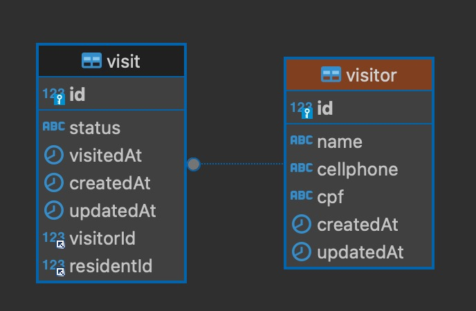
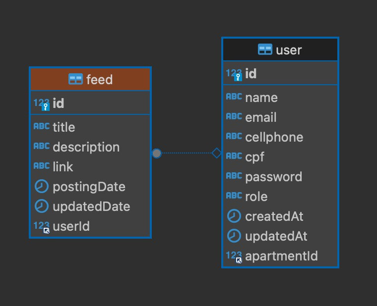

# Front-end Web

O projeto front-end do sistema "Zeus - Gestão Condominial" tem como objetivo principal facilitar a comunicação entre o síndico e os moradores, centralizando informações de gestão e automatizando a troca de notificações. Ele oferece funcionalidades como um quadro de comunicação e notícias do condomínio, além de um controle eficiente de cadastro de moradores, funcionários e visitantes. Também permite o registro de visitantes para controle de acesso, proporcionando maior segurança e facilidade na administração do condomínio.

## Tecnologias Utilizadas
 - Typescript
 - Vue.js 3
 - Docker
 - Pinia
 - Axios
 - Vuetify
 - Vue Router

## Arquitetura

O Vue possui uma estrutura base com as view, router, components, com renderização de componentes no modelo o SPA (Single Page Aplication) com SCR (Side Client Rendering).

As view principais foram divididas entre a Site e Sistema, sendo o Sistema com diversas views relacionadas aos nossos serviços e cada serviço com seus respectivos componentes auxiliares para consumo das APIs realizando o CRUD de cada um, como Modais, Tabelas, Formulários e etc.

Também conta com uma pasta de interface referente a cada serviço do sistema para melhor controle de tipagem.

E por fim, utiliza o Pinia para fazer controle central de estado das variaveis reutilizadas por diversos componentes, separado por modulos referentes aos serviços disponíveis no sistema.

Serviços:
- Auth
- User
- Apartment
- Resident
- Visitor
- Employee
- Document
- Feed
- Visit

## Modelagem da Aplicação

Nossa estrutura de dados se constitui das entidades:
- user
- visitor
- visit
- feed
- document
- apartment

Os diagramas de modelagem segue nas imagens abaixo:

## Projeto da Interface Web
A interface web do sistema de gestão de condomínios é projetada com foco na usabilidade, responsividade e experiência do usuário, permitindo fácil navegação em diferentes dispositivos.

### Design Visual e Layout
•	Estilo visual: A interface adota um design moderno e minimalista, com uma paleta de cores sóbria e neutra (tons de azul, cinza e branco), focada em transmitir simplicidade e profissionalismo. Ícones são utilizados para auxiliar na identificação rápida das funções.

•	Tipografia: Fonte sans-serif clara, com tamanhos ajustados para boa legibilidade em dispositivos móveis e desktop.

•	Responsividade: Todas as páginas são desenvolvidas com um design mobile-first, utilizando técnicas de CSS Flexbox e Grid para garantir que o layout se ajuste dinamicamente a diferentes resoluções de tela, desde smartphones até monitores de desktop.

### Layout das Páginas
- Página de Login:

•	Inclui campos de usuário e senha, com validação básica de campos vazios e botões estilizados para "Entrar" e "Esqueci minha senha".

•	Feedback visual de erros ou sucessos ao tentar logar.

•	Redirecionamento para a página inicial do sistema após o login.

- Dashboard Principal:

•	Quadro de avisos e notificações: Central na página inicial, onde o síndico ou administradores podem publicar informações relevantes para todos os moradores, como notícias ou eventos importantes. Cada notificação tem um título, breve descrição, e data.

•	Menus laterais: Dispostos verticalmente, oferecendo links de navegação rápida para as principais áreas do sistema: "Cadastro de Moradores", "Cadastro de Funcionários", "Controle de Visitantes", "Relatórios" e "Configurações".

- Páginas de Cadastro (Moradores, Funcionários, Visitas):

•	Formulários organizados de maneira clara, com campos de entrada validados para dados essenciais como nome, CPF, e-mail e unidade.

•	Botões de ação (Salvar, Cancelar) posicionados ao final dos formulários, com feedback visual de sucesso ou erro após cada operação.

•	Funcionalidade de busca em tempo real na lista de cadastrados, permitindo filtrar por nome ou unidade.

- Controle de Acesso de Visitantes:

•	Tela para registro de entradas e saídas de visitantes, com integração visual aos sistemas de portaria.

•	Campos para o cadastro de visitantes em tempo real, integrados com dispositivos de controle de acesso (como portões ou catracas).

•	Indicadores visuais para status de visitantes (entradas registradas ou aguardando confirmação).

### Interações do Usuário
•	Atualização em tempo real: Sempre que um morador ou síndico adiciona uma nova notificação ou atualização no quadro de avisos, todos os usuários conectados conseguem visualizar essa notificação ao acessar a listagem de Feed de Notícias.

•	Feedback visual: O sistema oferece feedback imediato nas ações do usuário, como salvar ou excluir dados, seja por meio de animações suaves, notificações contextuais (pop-ups) ou mudanças de cor nos botões (verde para sucesso, vermelho para erro).

•	Menus de navegação: Responsivos e colapsáveis em dispositivos móveis, permitindo uma navegação fácil com o toque.
Outros Aspectos Relevantes

•	Segurança: A aplicação possui autenticação via JWT (JSON Web Token) para garantir que o acesso seja seguro e as sessões sejam gerenciadas com proteção.

•	Acessibilidade: Implementação de práticas de acessibilidade web (WCAG), como contraste de cores adequado, navegação por teclado e textos alternativos em imagens para garantir que a aplicação seja utilizável por todos os usuários.

•	API para Integração: O sistema interage com o backend por meio de uma API REST, permitindo uma comunicação eficiente entre o front-end e o servidor para operações de CRUD (Create, Read, Update, Delete).

Este design visa proporcionar uma experiência fluida e eficiente, permitindo que os administradores e moradores gerenciem facilmente suas tarefas diárias relacionadas ao condomínio.

### Wireframes / Protótipo

Link para o figma: https://www.figma.com/design/jkSJWbD4UvI20gUb0WUTpQ/ZEUS?node-id=49-2&node-type=frame&t=EPjWwMMsoZFrOGdI-0

### Design Visual
Utilizamos componentes visuais do Vuetify, com a paleta de cores deles para auxiliar:

thema light: 
- azul escuro: #01579B
- laranja claro: #FB8C00
- fundo claro: branco

thema dark:
- cinza escuro: #263238
- laranja escuro: #F57C00
- fundo escuro: preto

### Layout Responsivo
O sistema é responsivo para diversos tipos de monitores e aparelhos como tablets.

### Interações do Usuário
O sistema permitirá as seguintes interações do usuário:
- Clicar nos nossos botões disponíveis no sistema para, criar conta, logar, acessar um item no menu, abrir e fechar modais, submeter formulários, etc.
- Escrolar as listagens das nossas tabelas.
- Preencher os campos de formulário.

## Fluxo de Dados
Para autenticação guardamos no localStorage os dados do usuário logado, incluindo o token JWT, e sempre que atualizar os dados de perfil os dados são atualizados no localStorage, seria um fluxo de dados do tipo:

Cliente <---> Cliente

O fluxo de principal de dados é feito por APIs com requisições e resposta e é do tipo:

Cliente <---> Servidor

## Requisitos Funcionais

| ID     | Descrição do Requisito                                           | Prioridade |
| ------ | ---------------------------------------------------------------- | ---------- |
| RF-001 | O SISTEMA DEVE PERMITIR O GERENCIAMENTO DE DADOS DE FUNCIONÁRIOS | ALTA       |
| RF-002 | O SISTEMA DEVE PERMITIR O GERENCIAMENTO DE DADOS DE MORADOR      | ALTA       |
| RF-003 | O SISTEMA DEVE PERMITIR O GERENCIAMENTO DE DADOS DE APARTAMENTO  | ALTA       |
| RF-004 | O SISTEMA DEVE PERMITIR O GERENCIAMENTO DE DADOS DE USUÁRIO      | ALTA       |
| RF-005 | O SISTEMA DEVE PERMITIR A AUTENTICAÇÃO DE USUÁRIOS               | ALTA       |
| RF-006 | O SISTEMA DEVE PERMITIR O CONTROLE DE QUADRO DE AVISOS           | MÉDIA      |

## Requisitos Não Funcionais

| ID      | Descrição do Requisito                                                                                          | Prioridade |
| ------- | --------------------------------------------------------------------------------------------------------------- | ---------- |
| RNF-001 | Usabilidade: O sistema deve permitir que complete uma tarefa de cadastro em no máximo 1 minuto.                 | BAIXA      |
| RNF-002 | Disponibilidade: O sistema deve ficar online 24H por dia, 7 dias na semana                                      | BAIXA      |
| RNF-003 | Segurança: O produto deve restringir o acesso por meio de senhas individuais para o usuário.                    | BAIXA      |
| RNF-004 | Desempenho: O sistema deve ser capaz de gerar relatórios em até 30 segundos.                                    | BAIXA      |
| RNF-005 | Usabilidade: Para utilizar o sistema, é necessário ter noções básicas de tecnologia e operação de computadores. | BAIXA      |

## Considerações de Segurança

O sistema só deve permitir criar contas de ADMIN diretamente via banco de dados manualmente.

## Implantação

[Instruções para implantar a aplicação distribuída em um ambiente de produção.]

1. Defina os requisitos de hardware e software necessários para implantar a aplicação em um ambiente de produção.
2. Escolha uma plataforma de hospedagem adequada, como um provedor de nuvem ou um servidor dedicado.
3. Configure o ambiente de implantação, incluindo a instalação de dependências e configuração de variáveis de ambiente.
4. Faça o deploy da aplicação no ambiente escolhido, seguindo as instruções específicas da plataforma de hospedagem.
5. Realize testes para garantir que a aplicação esteja funcionando corretamente no ambiente de produção.

## Testes

Serão testados os fluxos referentes aos endpoints do back-end do sistema. Será feito um vídeo e anexado seu link mostrando o funcionamento.

Link:

# Referências

[Documentação Vue](https://vuejs.org/guide/introduction.html)

[Documentação Vuetify.](https://vuetifyjs.com/en/introduction/why-vuetify/#what-is-vuetify3f)

[Documentação Axios](https://axios-http.com/ptbr/docs/intro)

[Documentação Pinia](https://pinia.vuejs.org/introduction.html)

[Documentação Docker](https://docs.docker.com/get-started/)
